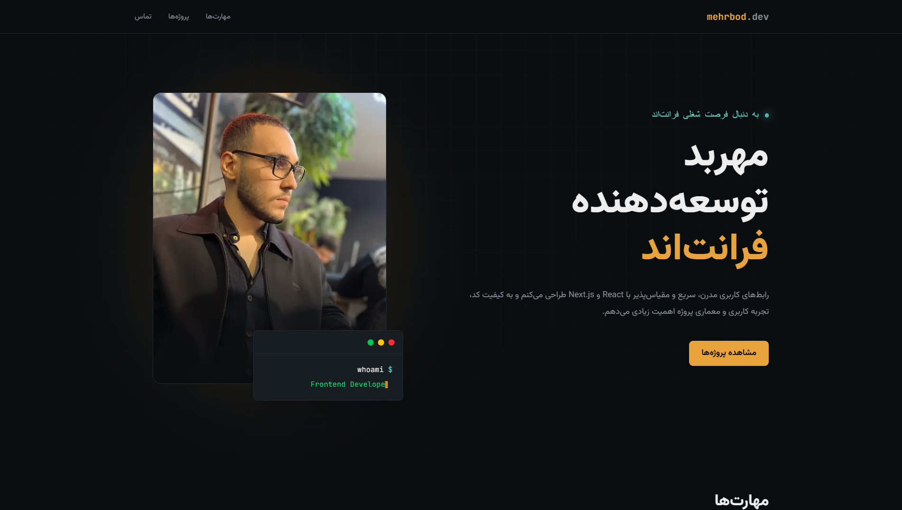

# 💼 Personal Portfolio

A modern, responsive, and minimal personal portfolio built with **Next.js**, **TypeScript**, and **Tailwind CSS** to showcase my skills, projects, and experience as a Frontend Developer.

## 🌐 Live Demo

> https://portfolio-iota-khaki-58.vercel.app/

## 📸 Preview

<p align="center">
  
</p>

## ✨ Features

- Responsive design
- Modern and clean UI
- Project showcase
- Skills section
- Contact section
- Optimized with Next.js
- Built with reusable components
- TypeScript support

## 🛠 Tech Stack

- Next.js
- TypeScript
- Tailwind CSS
- Framer Motion
- Lucide React

## 📁 Project Structure

```text
src
├── app
├── components
│   ├── common
│   ├── hero
│   ├── layout
│   ├── projects
│   └── skills
├── data
├── hooks
├── types
└── utils
```

## 🚀 Getting Started

Clone the repository:

```bash
git clone https://github.com/your-username/portfolio.git
```

Go to the project directory:

```bash
cd portfolio
```

Install dependencies:

```bash
npm install
```

Run the development server:

```bash
npm run dev
```

Open **http://localhost:3000** in your browser.

## 📬 Contact

If you'd like to get in touch, feel free to connect with me through my portfolio or GitHub profile.

## 📄 License

This project is licensed under the MIT License.
